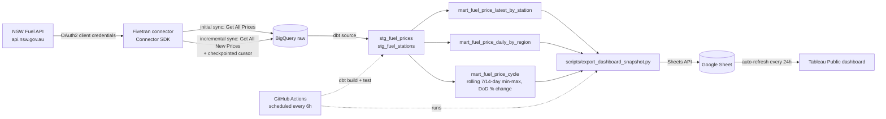

# NSW Fuel Pulse

NSW Fuel Pulse ingests live service-station fuel prices from the NSW Fuel
API into BigQuery via a custom Fivetran Connector SDK connector, models
them with dbt, and publishes a Tableau Public dashboard that stays fresh
automatically -- no manual refresh -- via a scheduled Google Sheets export.

This is a portfolio project, built as a companion to
[tfnsw-transit-pulse](https://github.com/andreshako/tfnsw-transit-pulse),
[planning-pulse-nsw](https://github.com/andreshako/planning-pulse-nsw), and
[australian-energy-pulse](https://github.com/andreshako/australian-energy-pulse).

## Purpose

- Ingest fuel-price and station reference data from the NSW Fuel API into
  BigQuery using a custom Fivetran connector (Connector SDK), with a real
  incremental sync strategy rather than a full reload every time.
- Model the raw data into clean, tested staging and mart layers using dbt,
  including a mart purpose-built to surface the well-known NSW petrol
  price cycle.
- Keep a public Tableau dashboard current without any manual refresh step,
  by writing a small, reviewed snapshot of the marts to a Google Sheet on
  a schedule -- the one data-source type Tableau Public auto-refreshes.

## Project status

The repo scaffold, the Fivetran connector (`connector/`), and the dbt
staging layer (`dbt/models/staging/`) exist. Both the connector's and the
staging layer's field names are written against this project's best-known
guess at the NSW Fuel API's shape, **not yet verified against a live
subscription** -- see [Before running this for
real](connector/README.md#before-running-this-for-real). Marts and the
export script are not built yet. See
[Roadmap](#roadmap-future-iterations) below for the build order.

## Architecture



Two BigQuery-writing identities, not one: Fivetran's service account only
ever writes `raw`; dbt's only ever reads `raw` and writes `staging`/
`marts`. A leaked credential in either place can't reach what the other
touches. See [GCP service accounts](#gcp-service-accounts) below.

## Data source

NSW Fuel API (`api.nsw.gov.au`) -- OAuth2 client-credentials auth, free
registration. See [`docs/data_source.md`](docs/data_source.md) for the
full registration steps, endpoint list, and coverage caveats.

### Attribution

Data sourced from the NSW Fuel API, published by NSW Fair Trading /
Service NSW (https://api.nsw.gov.au). See
[`docs/data_source.md`](docs/data_source.md#attribution) for licence
terms to confirm on registration.

## GCP service accounts

Three separate service accounts, least-privilege and single-purpose --
same separation-of-duties pattern as tfnsw-transit-pulse:

| Service account | Roles | Used by |
|---|---|---|
| nsw-fuel-fivetran | BigQuery Data Editor + Job User, scoped to `raw` | The deployed Fivetran connector |
| nsw-fuel-dbt-runner | BigQuery Data Viewer on `raw`, Data Editor on `staging`/`marts` | Local `dbt build`, via the `dev` profile target |
| nsw-fuel-ci | Same roles as nsw-fuel-dbt-runner, separate identity/key | `.github/workflows/scheduled_pipeline.yml`, via the `ci` profile target |

A fourth, narrowly-scoped Google Sheets service account (editor on one
target Sheet only, nothing else in Drive) is used by
`scripts/export_dashboard_snapshot.py`.

## dbt setup

`dbt/` is a dbt-bigquery project (profile name `nsw_fuel_pulse`):

```
dbt/
  dbt_project.yml
  packages.yml              # dbt-labs/dbt_utils
  profiles.yml.example       # copy to profiles.yml (gitignored)
  models/
    staging/                 # stg_fuel_prices, stg_fuel_stations
    marts/                   # mart_fuel_price_* -- not built yet
```

```bash
cp dbt/profiles.yml.example dbt/profiles.yml
cd dbt
dbt deps
dbt build
```

Planned tests: `not_null` and `accepted_values` on fuel type codes,
composite grain uniqueness (`dbt_utils.unique_combination_of_columns`),
and `dbt_utils.accepted_range` sanity bounds on price so an obviously
malformed reading can't silently enter a mart.

## CI

Two workflows, deliberately separated by what they touch:

- **`.github/workflows/ci.yml`** -- runs on every push/PR that touches the
  dbt project. Validates the project parses (`dbt parse`) using
  CI-safe placeholder defaults baked into `profiles.yml.example`. Never
  touches real BigQuery data and needs no secrets.
- **`.github/workflows/scheduled_pipeline.yml`** -- runs every 6 hours (and
  on manual dispatch). Authenticates as the `nsw-fuel-ci` service account,
  runs `dbt build` and `dbt test` against real BigQuery data, then runs
  `scripts/export_dashboard_snapshot.py` to refresh the Google Sheet the
  Tableau dashboard reads from.

## Dashboard

A Tableau Public workbook connected to the Google Sheet that
`scripts/export_dashboard_snapshot.py` writes. Tableau Public
auto-refreshes Google Sheets connections every 24 hours -- the only data
source type it auto-refreshes without a paid Tableau Server/Cloud
subscription -- which is why the pipeline targets a Sheet rather than a
committed CSV snapshot (contrast with planning-pulse-nsw's `dashboard_data/`
folder, which works because that dashboard is Streamlit, not Tableau
Public). This is a deliberate design decision, not a workaround.

Two tabs, shaped for the workbook I'll build by hand in Tableau Public's
editor:

- Current cheapest fuel by region (for a map)
- Price-cycle trend data (for a line chart)

## Data caveats

- Prices are self-reported by service station operators and may lag the
  actual price at the bowser.
- Sync frequency is governed by Fivetran's free-tier scheduling (hourly/
  daily), not real-time -- this is a polled, low-frequency pipeline, not a
  live feed.
- Coverage may vary by station and region depending on operator reporting
  compliance; absence of a price update does not necessarily mean the
  price didn't change.

## Current limitations

- No dbt models, export script, or dashboard yet. See
  [Project status](#project-status).
- The connector's response parsing is unverified against a live NSW Fuel
  API subscription -- see
  [connector/README.md](connector/README.md#before-running-this-for-real).
- No historical backfill: the pipeline's history starts the day the
  Fivetran connector's initial sync first runs -- the NSW Fuel API doesn't
  expose historical price data.
- `mart_fuel_price_cycle`'s rolling 7/14-day windows will read as noise
  until at least that many days of real data have accumulated.

## Roadmap (future iterations)

1. ~~**Repo scaffold** -- folders, dbt project config, `.env.example`, CI
   workflow shapes.~~ Done.
2. ~~**Fivetran connector** -- `connector/connector.py`: OAuth2 auth, initial
   sync via Get All Prices, incremental sync via Get All New Prices with
   Fivetran checkpoint/state.~~ Built; still needs validation against a
   live subscription (`fivetran debug`) and deployment via the Connector
   SDK's standard workflow -- see [connector/README.md](connector/README.md).
3. ~~**dbt staging models** -- `stg_fuel_prices`, `stg_fuel_stations`, and
   the `_staging__sources.yml` source contract for the raw tables the
   connector produces.~~ Built and `dbt parse`-verified; field names still
   need confirming against a live subscription (same caveat as the
   connector).
4. **dbt marts and tests** -- `mart_fuel_price_latest_by_station`,
   `mart_fuel_price_daily_by_region`, `mart_fuel_price_cycle`, plus the
   grain/range/accepted-value tests described above.
5. **Export script** -- `scripts/export_dashboard_snapshot.py`, writing
   the two dashboard-ready tabs to Google Sheets.
6. **Tableau Public dashboard** -- built by hand against the Sheet, once
   its data is stable.
7. **Optional: Snowflake target** -- a second dbt target using the
   `dbt-snowflake` adapter, run manually during a Snowflake trial and
   documented with screenshots, to demonstrate warehouse portability. Not
   part of the always-on pipeline.
8. **Optional: price-cycle vs. public holidays** -- cross-referencing
   `mart_fuel_price_cycle` troughs against NSW public holidays/events.

## Repository layout

```
connector/          Fivetran Connector SDK connector -- connector.py
                     (schema/update wiring), nsw_fuel_client.py (API
                     auth/HTTP), requirements.txt (own deploy manifest,
                     separate from the repo root requirements.txt)
dbt/
  models/staging/    stg_fuel_prices, stg_fuel_stations
  models/marts/      mart_fuel_price_latest_by_station,
                      mart_fuel_price_daily_by_region,
                      mart_fuel_price_cycle
scripts/             export_dashboard_snapshot.py -- writes marts to
                     Google Sheets
docs/                data_source.md -- NSW Fuel API registration + endpoints
.github/workflows/   ci.yml (structural validation, no secrets) and
                     scheduled_pipeline.yml (real build/test/export, every 6h)
```

## License

TBD.
