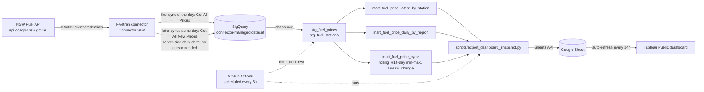

# NSW Fuel Pulse

NSW Fuel Pulse ingests live service-station fuel prices from the NSW Fuel
API into BigQuery via a custom Fivetran Connector SDK connector, models
them with dbt, and publishes a Tableau Public dashboard that stays fresh
automatically -- no manual refresh -- via a scheduled Google Sheets export.

This is a portfolio project, built as a companion to
[tfnsw-transit-pulse](https://github.com/andreshako/tfnsw-transit-pulse),
[planning-pulse-nsw](https://github.com/andreshako/planning-pulse-nsw), and
[australian-energy-pulse](https://github.com/andreshako/australian-energy-pulse).

## Purpose

- Ingest fuel-price and station reference data from the NSW Fuel API into
  BigQuery using a custom Fivetran connector (Connector SDK), with a real
  incremental sync strategy rather than a full reload every time.
- Model the raw data into clean, tested staging and mart layers using dbt,
  including a mart purpose-built to surface the well-known NSW petrol
  price cycle.
- Keep a public Tableau dashboard current without any manual refresh step,
  by writing a small, reviewed snapshot of the marts to a Google Sheet on
  a schedule -- the one data-source type Tableau Public auto-refreshes.

## Project status

**The pipeline is live end-to-end against real data.** The connector is
deployed to Fivetran and has completed a real production sync (3,316
stations, ~10,600 prices); `dbt build` has run for real against that
synced data, all three marts are populated, and every test passes (two
deliberately downgraded to warnings -- see [Data
model](#data-model)). See
[connector/README.md](connector/README.md#verified-against-the-live-api)
and [Current limitations](#current-limitations) for what real-data
testing caught and corrected along the way -- including a real Fivetran
behavior that changed part of this project's own architecture (see the
`nsw_fuel_pulse` vs `raw` dataset note below). What's left: building the
Tableau Public workbook by hand, and letting the scheduled pipeline run
unattended for a few days to accumulate real price-cycle history -- see
[Roadmap](#roadmap-future-iterations) below.

## Architecture



Two BigQuery-writing identities, not one: Fivetran's service account only
ever writes the connector-managed dataset; dbt's only ever reads that
dataset and writes `staging`/`marts`. A leaked credential in either place
can't reach what the other touches. See [GCP service
accounts](#gcp-service-accounts) below.

**A real finding that changed this project's own design:** the raw
dataset isn't actually called `raw`. Confirmed against a real Fivetran
deployment, the Connector SDK integration names the destination dataset
after the *connection name* you choose when deploying (`nsw_fuel_pulse`
in this project), not the BigQuery destination's own "Dataset name" form
field -- that field doesn't control this the way the Fivetran UI implies
it might. `BQ_RAW_DATASET` (env var, defaulting to `raw` only as a
credential-free placeholder for `dbt parse` in CI) is what actually
controls this throughout the project -- set it to your connection's real
name, not assumed to be `raw`.

## Data source

NSW Fuel API -- OAuth2 client-credentials auth, free registration at
`api.nsw.gov.au` (the developer portal; the real API host,
`api.onegov.nsw.gov.au`, is different -- see
[`docs/data_source.md`](docs/data_source.md) for why that distinction
matters). See that doc for the full registration steps, confirmed
endpoint URLs/headers/response shapes, and coverage caveats.

### Attribution

Data sourced from the NSW Fuel API, published by NSW Fair Trading /
Service NSW (https://api.nsw.gov.au). See
[`docs/data_source.md`](docs/data_source.md#attribution) for licence
terms to confirm on registration.

## GCP service accounts

Three separate service accounts, least-privilege and single-purpose --
same separation-of-duties pattern as tfnsw-transit-pulse:

| Service account | Roles | Used by |
|---|---|---|
| nsw-fuel-fivetran | BigQuery User (project-level, required by Fivetran's own setup) + Data Editor on its own connector-managed dataset | The deployed Fivetran connector |
| nsw-fuel-dbt-runner | BigQuery Data Viewer on the connector-managed dataset, Data Editor on `staging`/`marts` | Local `dbt build`, via the `dev` profile target |
| nsw-fuel-ci | Same roles as nsw-fuel-dbt-runner, separate identity/key | `.github/workflows/scheduled_pipeline.yml`, via the `ci` profile target |

The project-level `BigQuery User` grant on nsw-fuel-fivetran is a real,
worth-naming tension with pure least-privilege: Fivetran's BigQuery
destination setup explicitly requires it (to create/discover its own
dataset), which is broader than the dataset-scoped access this project
originally designed for that account. Not something this project's IAM
model controls around, since Fivetran's own setup requires it.

A fourth, narrowly-scoped Google Sheets service account (editor on one
target Sheet only, nothing else in Drive) is used by
`scripts/export_dashboard_snapshot.py`.

## Data model

- **"Region" means suburb.** The NSW Fuel API's reference data covers
  stations/fuel types/brands, not a separate region list, so
  `mart_fuel_price_daily_by_region` and `mart_fuel_price_cycle` group by
  station suburb -- the finest geography actually available, rather than
  an invented, unverified region concept. Suburb itself is parsed out of
  the API's single combined address string (there's no dedicated
  suburb/postcode field) and is NULL for the ~3% of real addresses that
  don't match the expected format -- confirmed against a real snapshot,
  not assumed; see `dbt/models/staging/stg_fuel_stations.sql`.
- **`mart_fuel_price_latest_by_station`** -- grain `(stationcode,
  fueltype)`. The station's most recently reported price, inner-joined to
  station details (not left-joined: an unmatched stationcode is dropped
  rather than shown with NULL station details, so a broken join is a
  visible row-count gap, not a misleading unlabeled map point).
- **`mart_fuel_price_daily_by_region`** -- grain `(report_date, suburb,
  fueltype)`. Aggregates each station's *last* reported price for the
  day, not every intraday price change -- a station updating its price
  three times in a day counts once, at its end-of-day price, so
  frequently-updating stations don't get more weight in the regional
  average than stable ones. `report_date` is the Sydney-local calendar
  date (source timestamps are UTC).
- **`mart_fuel_price_cycle`** -- grain `(report_date, suburb, fueltype)`,
  built on the mart above. Day-over-day change via `LAG()`, plus rolling
  7/14-day min/max via a window frame (same pattern as
  `mart_daily_generation_trend` in australian-energy-pulse). The rolling
  windows are the last 7/14 *rows* for a partition, not strictly the last
  7/14 *calendar days* -- a suburb/fuel-type combination with a gap day
  (no price updates at all) makes the window silently span more real days
  than its name suggests. Not corrected here; see [Current
  limitations](#current-limitations).
- **Tests:** `not_null` and `accepted_values` on fuel type codes (and on
  station state), composite grain uniqueness on every mart
  (`dbt_utils.unique_combination_of_columns`), `dbt_utils.accepted_range`
  sanity bounds on price (50-400 cents/litre -- generous, catches
  impossible values like a unit error, not "unusually high" days), and a
  singular test per mart asserting it isn't empty (`dbt/tests/`) -- added
  proactively here after tfnsw-transit-pulse hit exactly that gap for
  real (an always-empty mart that passed every schema test).
- **The price range test excludes `EV`.** Confirmed against real synced
  data: `EV` rows price 0.0-45.0, a completely different scale from every
  real liquid fuel type's 170-475 range -- electricity isn't sold "per
  litre," so `price_cents_per_litre` doesn't mean the same thing for EV
  rows as for everything else. Excluded from the range test (`where:
  "fueltype != 'EV'"`) rather than widening the bound until it stops
  meaning anything for the fuel types it's meant to protect.
- **The price range test is a warning, not a hard error.** Three real,
  stale `E85` records (price 475.0, last updated mid-2025, never updated
  since) trip it on every real build -- a genuine, rare source-data
  anomaly found through real testing, not a pipeline bug. Downgraded to
  `severity: warn` rather than either blocking the entire scheduled
  production run over 3 rows out of ~10,600, or silently widening the
  bound to accommodate them.
- **`suburb` has no `not_null` test**, deliberately -- it's genuinely
  NULL for the ~3% of stations whose address didn't parse (see above), so
  a `not_null` test would just be a self-contradicting test that always
  fails against documented, expected behaviour.

## dbt setup

`dbt/` is a dbt-bigquery project (profile name `nsw_fuel_pulse`):

```
dbt/
  dbt_project.yml
  packages.yml              # dbt-labs/dbt_utils
  profiles.yml.example       # copy to profiles.yml (gitignored)
  models/
    staging/                 # stg_fuel_prices, stg_fuel_stations
    marts/                   # mart_fuel_price_latest_by_station,
                              # mart_fuel_price_daily_by_region,
                              # mart_fuel_price_cycle
  tests/                     # empty-mart guards, one per mart
```

```bash
cp dbt/profiles.yml.example dbt/profiles.yml
cd dbt
dbt deps
dbt build
```

Verified with the real `dbt-bigquery` adapter: `dbt parse`, `dbt list`,
and dependency resolution (`mart_fuel_price_cycle` ->
`mart_fuel_price_daily_by_region` -> staging -> sources) all succeed as
expected. `dbt build`/`dbt test` need real BigQuery credentials -- see
[CI](#ci) below.

## CI

Two workflows, deliberately separated by what they touch:

- **`.github/workflows/ci.yml`** -- runs on every push/PR that touches the
  dbt project. Validates the project parses (`dbt parse`) using
  CI-safe placeholder defaults baked into `profiles.yml.example`. Never
  touches real BigQuery data and needs no secrets.
- **`.github/workflows/scheduled_pipeline.yml`** -- runs every 6 hours (and
  on manual dispatch). Authenticates as the `nsw-fuel-ci` service account,
  runs `dbt build` and `dbt test` against real BigQuery data, then runs
  `scripts/export_dashboard_snapshot.py` to refresh the Google Sheet the
  Tableau dashboard reads from.

## Dashboard

A Tableau Public workbook connected to the Google Sheet that
`scripts/export_dashboard_snapshot.py` writes. Tableau Public
auto-refreshes Google Sheets connections every 24 hours -- the only data
source type it auto-refreshes without a paid Tableau Server/Cloud
subscription -- which is why the pipeline targets a Sheet rather than a
committed CSV snapshot (contrast with planning-pulse-nsw's `dashboard_data/`
folder, which works because that dashboard is Streamlit, not Tableau
Public). This is a deliberate design decision, not a workaround.

Two tabs, shaped for the workbook I'll build by hand in Tableau Public's
editor. Both tabs must already exist in the target Sheet -- the export
script only clears and rewrites existing tabs, it doesn't create new
ones:

| Sheet tab | Source mart | For |
|---|---|---|
| `current_by_station` | `mart_fuel_price_latest_by_station` | Map (lat/long per row) |
| `price_cycle` | `mart_fuel_price_cycle` | Line chart |

```bash
python scripts/export_dashboard_snapshot.py
```

Clears and fully overwrites both tabs on every run (never appends), so a
run with fewer rows than the last one never leaves stale rows behind.

## Data caveats

- Prices are self-reported by service station operators and may lag the
  actual price at the bowser.
- Sync frequency is governed by Fivetran's free-tier scheduling (hourly/
  daily), not real-time -- this is a polled, low-frequency pipeline, not a
  live feed.
- Coverage may vary by station and region depending on operator reporting
  compliance; absence of a price update does not necessarily mean the
  price didn't change.

## Current limitations

- No Tableau workbook yet -- everything else is live, see [Project
  status](#project-status).
- The export script is verified for imports/syntax against the real
  Google client libraries and a real Google Sheet (confirmed shared
  correctly with the export service account), but hasn't written real
  mart data to it yet.
- `location`'s nested latitude/longitude land in real BigQuery as a
  native `JSON`-typed column, not a STRUCT/RECORD -- confirmed against a
  real production sync (the local `fivetran debug` DuckDB warehouse
  misleadingly suggested the same, but for a different, unverified
  reason). `stg_fuel_stations.sql` uses `lax_float64()`, BigQuery's
  purpose-built lenient JSON-to-scalar extraction, not a plain cast.
- Suburb/postcode are parsed from a single combined address string with
  no dedicated fields (~97% match rate on a real snapshot) -- see [Data
  model](#data-model).
- The Fivetran-managed dataset is named after the connection
  (`nsw_fuel_pulse`), not `raw` as originally designed -- see the
  Architecture section above.
- No historical backfill: the pipeline's history starts the day the
  Fivetran connector's first real sync runs -- the NSW Fuel API doesn't
  expose historical price data.
- `mart_fuel_price_cycle`'s rolling 7/14-day windows will read as noise
  until at least that many days of real data have accumulated, and are
  measured in rows, not strictly calendar days -- see [Data
  model](#data-model).
- The NSW Fuel API's free tier caps at 2,500 calls/month and 5 calls/
  minute -- worth keeping in mind alongside Fivetran's own sync-frequency
  limits when choosing how often this runs.
- "Region" means suburb, not an official NSW region breakdown -- see
  [Data model](#data-model) for why.

## Roadmap (future iterations)

1. ~~**Repo scaffold** -- folders, dbt project config, `.env.example`, CI
   workflow shapes.~~ Done.
2. ~~**Fivetran connector** -- `connector/connector.py`: OAuth2 auth, initial
   sync via Get All Prices, incremental sync via Get All New Prices with
   Fivetran checkpoint/state.~~ Built, deployed to Fivetran, and has
   completed a real production sync -- see
   [connector/README.md](connector/README.md).
3. ~~**dbt staging models** -- `stg_fuel_prices`, `stg_fuel_stations`, and
   the `_staging__sources.yml` source contract for the raw tables the
   connector produces.~~ Built and confirmed working against real synced
   data with a real `dbt build`.
4. ~~**dbt marts and tests** -- `mart_fuel_price_latest_by_station`,
   `mart_fuel_price_daily_by_region`, `mart_fuel_price_cycle`, plus the
   grain/range/accepted-value tests described above.~~ Built and passing
   against real data (37 pass, 2 deliberate warnings -- see [Data
   model](#data-model)).
5. ~~**Export script** -- `scripts/export_dashboard_snapshot.py`, writing
   the two dashboard-ready tabs to Google Sheets.~~ Built and verified
   against the real Google client libraries and a real, correctly-shared
   Google Sheet; not yet run with real mart data flowing through it.
6. **Tableau Public dashboard** -- built by hand against the Sheet, once
   the export script has run against real mart data and a few days of
   price-cycle history have accumulated.
7. **Optional: Snowflake target** -- a second dbt target using the
   `dbt-snowflake` adapter, run manually during a Snowflake trial and
   documented with screenshots, to demonstrate warehouse portability. Not
   part of the always-on pipeline.
8. **Optional: price-cycle vs. public holidays** -- cross-referencing
   `mart_fuel_price_cycle` troughs against NSW public holidays/events.

## Repository layout

```
connector/          Fivetran Connector SDK connector -- connector.py
                     (schema/update wiring), nsw_fuel_client.py (API
                     auth/HTTP), requirements.txt (own deploy manifest,
                     separate from the repo root requirements.txt)
dbt/
  models/staging/    stg_fuel_prices, stg_fuel_stations
  models/marts/      mart_fuel_price_latest_by_station,
                      mart_fuel_price_daily_by_region,
                      mart_fuel_price_cycle
  tests/             empty-mart guard, one singular test per mart
scripts/             export_dashboard_snapshot.py -- clears and rewrites
                     two Google Sheet tabs from the marts
docs/                data_source.md -- NSW Fuel API registration + endpoints
.github/workflows/   ci.yml (structural validation, no secrets) and
                     scheduled_pipeline.yml (real build/test/export, every 6h)
```

## License

TBD.
